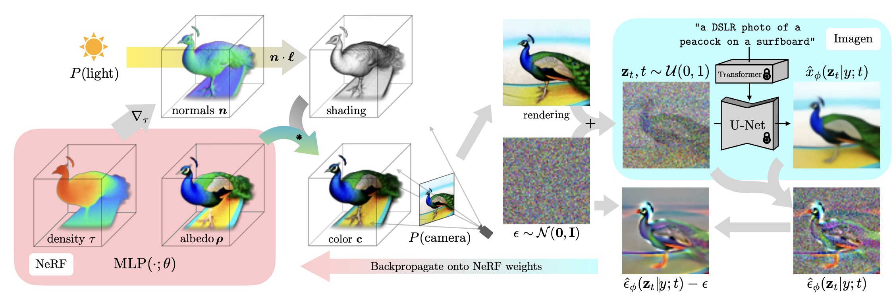
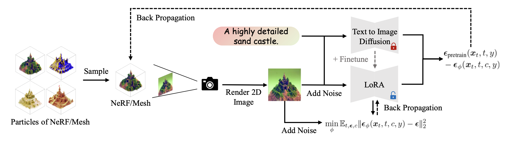
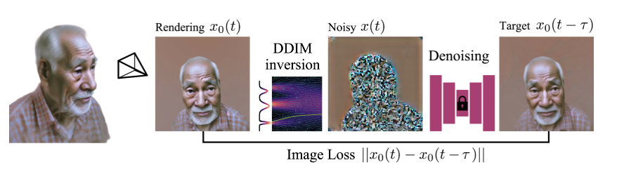
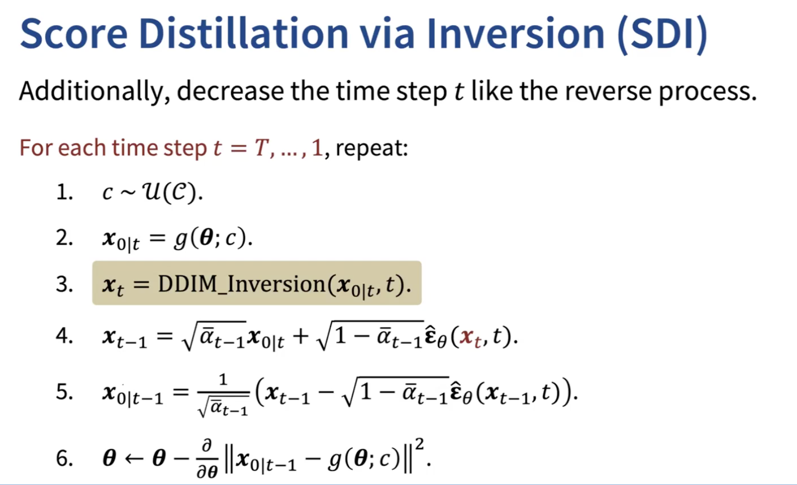

<div align="center">
  <h1>
  Score Distillation Sampling
  </h1>
  <p>
    <b>NYCU: Image and Video Generation (2025 Fall)</b><br>
    Programming Assignment 3
  </p>
</div>

<div align="center">
  <p>
    Instructor: <b>Yu-Lun Liu</b><br>
    TA: <b>Ying-Huan Chen</b>
  </p>
</div>

<p align="center">
  
</p>

---

## Description

Score Distillation Sampling (SDS) is a diffusion-based technique that leverages a pretrained model to guide generation by **distilling the score** (how a sample aligns with the target distribution) back into the optimization of a parameterized target (e.g., a latent image).

This assignment focuses on **text-to-image** with three methods:

- **SDS** (Task 1)
- **VSD** – Variational Score Distillation (Task 2)
- **SDI** – Score Distillation via Inversion (Task 3)

---

## Setup

```
conda create -n lab3 python=3.9
conda activate lab3
pip install -r requirements.txt
```

### Hugging Face Access

1. Sign in to **Hugging Face**.
2. Create / copy your access token at **https://huggingface.co/settings/tokens**.
3. From your terminal, log in:

   ```bash
   huggingface-cli login
   
4. enter your token.
---

## Code Structure

```
.
├── assets/                   # images for README (teaser, method figs)
├── data/
│   └── prompt_img_pairs.json # prompts used by eval scripts
├── docs/                     # result tables and notes
├── guidance/
│   └── sd.py                 # implement: get_sds_loss / get_vsd_loss / get_sdi_loss
├── output/                   # local checkpoints and logs
├── outputs/                  # generated images and eval JSON files
├── eval.py                   # CLIP evaluation
├── eval.sh                   # unified evaluator (SDS / VSD / SDI)
├── main.py                   # training/optimization entry
├── utils.py                  # helpers (I/O, image save)
├── requirements.txt
└── README.md
```

---

## Task 0: Introduction
Distillation sampling parameterizes the target content (e.g., images) and optimizes the parameters using the gradient of the distillation loss function $\nabla_{x^0} L$. In this assignment, we denote $`c`$ as a text prompt, $`\mathbf{x^{t}}`$ as a noisy sample, $`\epsilon`$ as a random sample from a standard Gaussian distribution, and $`\epsilon_\theta(\cdot, \cdot, \cdot)`$ as a pretrained diffusion model that predicts the noise in the input. 


We focus on **text-to-image** (no editing tasks). Use `data/prompt_img_pairs.json` for evaluation prompts.  
For each task, implement the loss function in `guidance/sd.py`. 

---

## Task 1 — Score Distillation Sampling (SDS) [20 pts]

<p align="center">

</p>

In this task, you will generate images using SDS. First, initialize latent $\mathbf{x^{0}} \sim \mathcal{N}(0, I)$ where the resolution matches the pretrained diffusion model ($`1 \times 4 \times 64 \times 64`$). Then randomly sample timestep $t$ and add noise to the latent, which outputs $`\mathbf{x^{t}}`$ (Equation 4 in [DDIM](https://arxiv.org/abs/2010.02502)). Lastly, feed the noisy latent to the pretrained diffusion model $`\epsilon_\theta(\mathbf{x^{t}}, c, t)`$ and compute the SDS loss provided below, which will be used to update the latent $`x^{0}`$. To visualize the sampled latents, use `decode_latents()` in `guidance/sd.py`.

$$
\begin{align*} 
\nabla_{x^{0}} L_{sds}= \mathbb{E}_ {t, \epsilon} \left[ ( \epsilon_\theta(\mathbf{x^{t}}, c, t) - \epsilon ) \right].
\end{align*}
$$

### ✅ TODO
Implement **`get_sds_loss()`** in `guidance/sd.py`.  
Return a scalar SDS loss given latent \(x^0\), text embedding \(c\), and CFG guidance.

### 💻 Run Command
```
python main.py --prompt "${PROMPT}" --loss_type sds --guidance_scale 25
```

---

## Task 2 — Variational Score Distillation (VSD) [30 pts]

<p align="center">

</p>

Variational Score Distillation (VSD) in ProlificDreamer aims to improve the sampling quality of SDS by utilizing [LoRA](https://mhsung.github.io/kaist-cs492d-fall-2024/programming-assignments/) to mimic the noise prediction of a pre-trained diffusion model. Given the pretrained diffusion model and a LoRA module, denoted as $\phi$, VSD optimizes the following loss:

$$
\begin{align*} 
\nabla_{x^{0}} L_{vsd}= \mathbb{E}_ {t, \epsilon} \left[ ( \epsilon_\theta(\mathbf{x^{t}}, c, t) - \epsilon_\phi(\mathbf{x^{t}}, c, t) ) \right].
\end{align*}
$$

### ✅ TODO
Implement **`get_vsd_loss()`** in `guidance/sd.py`.  
Generate images using the same text prompts provided in [Task 1](#task-1-score-distillation-sampling-sds). For VSD, use 7.5 for the `guidance_scale`.

### 💻 Run Command
```
python main.py --prompt "${PROMPT}" --loss_type vsd --guidance_scale 7.5 \
               --lora_lr 1e-4 --lora_loss_weight 1.0 --lora_rank 4
```

---

## Task 3 — Score Distillation via Inversion (SDI) [30 pts]

<p align="center">
  
</p>

SDI improves SDS stability by performing **DDIM inversion** before computing score differences.

<p align="center">
  
</p>


### ✅ TODO

Implement **`get_sdi_loss()`** in `guidance/sd.py`, and **complete all in-function `TODO` items**.  

**Additional Arguments:**
- `inversion_guidance_scale` (default **-7.5**): CFG scale used **during DDIM inversion** (often negative for stable inversion).
- `inversion_n_steps` (default **10**): number of inversion steps from `x₀` to `x_t` (more steps = more accurate, slower).
- `inversion_eta` (default **0.3**): stochasticity of inversion (`0` = deterministic DDIM).
- `update_interval` (default **25**): refresh the cached `x₀^{target}` every **N** iterations to reduce cost and jitter.


### 💻 Run Command
```
python main.py --prompt "${PROMPT}" --loss_type sdi --lr 0.005 --steps 1000 --guidance_scale 7.5 \
               --inversion_n_steps 10 --inversion_guidance_scale -7.5 \
               --inversion_eta 0.3 --sdi_update_interval 25
```
---

## Evaluation

Use the unified evaluation script `eval.sh`:

```
bash eval.sh --sds
bash eval.sh --vsd --guidance 7.5 --lora-lr 1e-4 --lora-loss-weight 1.0 --lora-rank 4
bash eval.sh --sdi --guidance 7.5 --lr 0.005 --steps 1000 \
             --inversion-n-steps 10 --inversion-guidance-scale -7.5 \
             --inversion-eta 0.3 --sdi-update-interval 25
```

Each command will:
1. Generate results for all default prompts.
2. Run CLIP evaluation automatically and save final results to:
```
./outputs/{loss_type}/
├── <prompt>.png
└── eval.json
```

---

## What to Submit

Submit `{STUDENT_ID}_lab3.zip` containing:
```
./submission/
├── guidance/sd.py
├── outputs/{sds,vsd,sdi}/ + eval.json
└── report.pdf
```

### Report (20 pts)

0. **Specify** all hyperparameters you used (per task).  
1. **Explain** SDS, VSD, and SDI — both the *concept* and your *implementation (code)*.  
2. **Compare** visual and CLIP results.  
3. **Intuitively analyze** why SDI and VSD perform better than SDS (**without heavy math**).  
4. **Discuss the influence of hyperparameters** — run ablations and justify your findings:
   - **SDS:** `guidance_scale`
   - **SDI:** `inversion_n_steps` (inversion steps), `sdi_update_interval` (update interval)


---

## Grading

| Component    | Points  | Description                           |
| ------------ | ------- | ------------------------------------- |
| Task 1 – SDS | 20      | Correct implementation + results      |
| Task 2 – VSD | 30      | Correct implementation + results      |
| Task 3 – SDI | 30      | Correct implementation + results      |
| Report       | 20      | Clear analysis, comparisons, insights |
| **Total**    | **100** |                                       |

### CLIP Score Thresholds
| CLIP Score | SDS (20 pts) | VSD/SDI (30 pts) |
| ---------- | ------------ | ---------------- |
| ≥ 0.28     | Full credit  | Full credit      |
| 0.26–0.28  | 15 pts   | 25 pts           |
| 0.24–0.26  | 10 pts   | 20 pts           |
| < 0.24     | 0            | 0                |

---

## Rules

- Modify **only** `guidance/sd.py`.
- Plagiarism → automatic zero.

---

## References

- https://github.com/KAIST-Visual-AI-Group/Diffusion-Assignment4-Distillation/tree/main
- DreamFusion: Text-to-3D using 2D Diffusion — https://arxiv.org/abs/2209.14988
- ProlificDreamer: Variational Score Distillation — https://arxiv.org/abs/2305.16213
- Score Distillation via Inversion (SDI) — https://arxiv.org/abs/2312.02164
