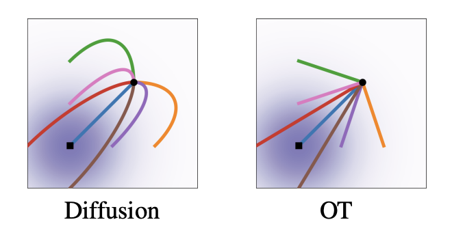

<div align="center">
  <h1>Flow Matching</h1>
  <p>
    <b>NYCU: Image and Video Generation (2025 Fall)</b><br>
    Programming Assignment 4
  </p>
</div>

<div align="center">
  <p>
    Instructor: <b>Yu-Lun Liu</b><br>
    TAs: <b>Jie-Ying Lee</b>, <b>Ying-Huan Chen</b>
  </p>
</div>

<div align="center">
   
</div>

---

## 📋 Overview

This assignment explores **Flow Matching** and its applications in generative modeling, consisting of **4 tasks** (3 required + 1 bonus):

### Grading Breakdown

| Component | Points | Description |
|-----------|--------|-------------|
| **Task 1** | 20 pts | 2D Flow Matching Implementation |
| **Task 2** | 25 pts | Image Flow Matching with Classifier-Free Guidance |
| **Task 3** | 25 pts | Rectified Flow for Faster Sampling |
| **Task 4** | +10 pts | **(Bonus)** InstaFlow One-Step Generation |
| **Report** | 30 pts | Analysis, Visualizations, and Discussion |
| **Total** | **100 pts** | **+ 10 pts Bonus** |

---

## 📁 Project Structure
```
.
├── task1_2d_flow_matching/     # Task 1: 2D toy dataset visualization
├── task2_image_flow_matching/  # Task 2: Image generation with FM
├── task3_rectified_flow/       # Task 3: Rectified Flow implementation
├── task4_instaflow/            # Task 4 (Bonus): One-step distillation
├── image_common/               # Shared utilities for image tasks
├── fid/                        # FID evaluation tools
├── assets/                     # README images and visual results
├── docs/                       # result summaries and implementation notes
├── data/                       # local datasets
├── results/                    # generated samples, checkpoints, and logs
└── requirements.txt            # Python dependencies
```

---

## 🔧 Setup

### Prerequisites

- **Python 3.10** (required for compatibility)
- CUDA-capable GPU (recommended)

### Installation
```bash
pip install -r requirements.txt
```

### Optional Dependencies

For Task 4 (InstaFlow):
```bash
pip install lpips  # For perceptual loss
```

---

## 📚 Recommended Reading

Understanding these papers will help you complete the assignment:

### Core Papers

- **Flow Matching** (Tasks 1 & 2)
  - [Flow Matching for Generative Modeling](https://arxiv.org/abs/2210.02747) (Lipman et al., 2022)
  - [Flow Matching: Visual Introduction](https://peterroelants.github.io/posts/flow_matching_intro/)

- **Rectified Flow** (Task 3)
  - [Flow Straight and Fast: Learning to Generate and Transfer Data with Rectified Flow](https://arxiv.org/abs/2209.03003) (Liu et al., 2022)

- **InstaFlow** (Task 4)
  - [InstaFlow: One Step is Enough for High-Quality Diffusion-Based Text-to-Image Generation](https://arxiv.org/abs/2309.06380) (Liu et al., 2023)

### Background

- **DDPM** (Reference for diffusion models)
  - [Denoising Diffusion Probabilistic Models](https://arxiv.org/abs/2006.11239) (Ho et al., 2020)

---

## 🎯 Tasks

### Task 1: 2D Flow Matching (20 points)

**Objective**: Implement and visualize Flow Matching on 2D toy datasets.

#### 📝 Implementation Requirements

Complete the following in `task1_2d_flow_matching/`:

**`fm.py`**:
- ✏️ `FMScheduler.compute_psi_t()` - Conditional flow ψ_t(x|x_1)
- ✏️ `FMScheduler.step()` - Euler ODE solver
- ✏️ `FlowMatching.get_loss()` - CFM training objective
- ✏️ `FlowMatching.sample()` - Sampling with CFG support

**`network.py`**:
- ✏️ `SimpleNet` - MLP velocity network (reuse from Assignment 1)

#### 🚀 Execution
```bash
jupyter notebook task1_2d_flow_matching/fm_tutorial.ipynb
```

The notebook trains the model and visualizes flow trajectories on the Swiss-roll dataset.

#### 📊 Deliverables

- Visualizations of learned trajectories
- Chamfer Distance metrics

#### 💯 Grading Criteria

| Chamfer Distance | Points |
|------------------|--------|
| < 40 | 20 pts |
| 40 ≤ CD < 60 | 10 pts |
| ≥ 60 | 0 pts |

---

### Task 2: Image Flow Matching with CFG (25 points)

**Objective**: Implement Flow Matching for conditional image generation on AFHQ dataset.

#### 📝 Implementation Requirements

Complete the following in `image_common/fm.py` (same TODOs as Task 1, adapted for images):

- ✏️ `FMScheduler.compute_psi_t()` - Conditional flow for images
- ✏️ `FMScheduler.step()` - Euler ODE solver
- ✏️ `FlowMatching.get_loss()` - CFM training loss
- ✏️ `FlowMatching.sample()` - Sampling with Classifier-Free Guidance

#### 🚀 Execution

**Step 1: Download Dataset**
```bash
python -m image_common.dataset
```

**Step 2: Train Flow Matching Model**
```bash
python -m task2_image_flow_matching.train --use_cfg
```

**Training Configuration**:
- Batch size: 16
- Training steps: 100,000
- Learning rate: 2e-4 (with warmup: 200 steps)
- CFG dropout: 0.1

**Step 3: Generate Samples**
```bash
python -m image_common.sampling \
  --use_cfg \
  --ckpt_path ${CKPT_PATH} \
  --save_dir ${SAVE_DIR} \
  --num_inference_steps 20
```

**Step 4: Evaluate FID**
```bash
python -m fid.measure_fid data/afhq/eval ${SAVE_DIR}
```

#### 📊 Deliverables

- Training loss curves
- FID scores with varying CFG scales (e.g., 1.0, 3.0, 7.5)
- Comparison across inference steps (10, 20, 50)
- Sample visualizations

#### 💯 Grading Criteria

| FID Score (CFG=7.5) | Points |
|---------------------|--------|
| < 30 | 25 pts |
| 30 ≤ FID < 50 | 15 pts |
| ≥ 50 | 0 pts |

---

### Task 3: Rectified Flow (25 points)

**Objective**: Straighten generation trajectories through reflow procedure to enable faster sampling.

#### 📝 Implementation Requirements

Complete the following in `task3_rectified_flow/generate_reflow_data.py`:

- ✏️ Generate synthetic (x_0, x_1) pairs by following the ODE trajectory of the Task 2 model

#### 🚀 Execution

**Step 1: Generate Reflow Dataset**

Create synthetic training pairs using your Task 2 model:
```bash
python -m task3_rectified_flow.generate_reflow_data \
  --ckpt_path ${TASK2_CKPT_PATH} \
  --num_samples 50000 \
  --save_dir data/afhq_reflow \
  --use_cfg \
  --num_inference_steps 20
```

**Step 2: Train Rectified Flow Model**

Train on synthetic pairs (same architecture/hyperparameters as Task 2):
```bash
python -m task3_rectified_flow.train_rectified \
  --reflow_data_path data/afhq_reflow \
  --use_cfg \
  --reflow_iteration 1
```

**Training Configuration**: Same as Task 2

**Step 3: Generate with Fewer Steps**

Test with reduced sampling steps:
```bash
# 5 steps
python -m image_common.sampling \
  --use_cfg \
  --ckpt_path ${RECTIFIED_CKPT_PATH} \
  --save_dir results/rectified_5steps \
  --num_inference_steps 5

# 10 steps
python -m image_common.sampling \
  --use_cfg \
  --ckpt_path ${RECTIFIED_CKPT_PATH} \
  --save_dir results/rectified_10steps \
  --num_inference_steps 10
```

**Step 4: Evaluate FID**
```bash
python -m fid.measure_fid data/afhq/eval results/rectified_5steps
python -m fid.measure_fid data/afhq/eval results/rectified_10steps
```

#### 📊 Deliverables

- FID scores at different inference steps (5, 10, 20)
- Comparison with Task 2 baseline (same step counts)
- Speedup analysis (wall-clock time measurements)
- **Discussion**: Why does rectified flow enable faster sampling?

#### 💯 Grading Criteria

| Performance (CFG=7.5) | Points |
|-----------------------|--------|
| FID < 30 with 5 steps | 25 pts |
| 30 ≤ FID < 50 with 5 or 10 steps | 15 pts |
| Otherwise | 0 pts |

---

### Task 4 (Bonus): InstaFlow One-Step Generation (+10 points)

**Objective**: Distill a rectified flow model into a one-step generator.

#### ⚠️ Important Notice

This is a **challenging bonus task** requiring careful tuning. Attempt only after completing Tasks 1-3.

**Key Challenges**:
- **Mode collapse risk**: One-step distillation is highly sensitive
- **Hyperparameter tuning**: Extensive experimentation may be needed
- **Data quality**: Requires large, diverse teacher-generated dataset
- **Training stability**: May need multiple reflow iterations (2-3) before distillation

**Recommendations**:
- Use high-quality 2-3x rectified flow teacher
- Generate 10K-50K diverse training samples
- Enable LPIPS loss for better perceptual quality
- Monitor for collapse (blurry/similar outputs)
- Budget sufficient time for iteration

**This task tests your understanding of distillation—don't be discouraged by initial failures!**

#### 📝 Implementation Requirements

Complete the following in `image_common/instaflow.py`:

**`InstaFlowModel.get_loss()`** - One-step distillation objective (Eq. 6):
- ✏️ Create t=0 tensor for batch
- ✏️ Predict velocity v(x_0, 0 | class_label)
- ✏️ Compute prediction: x1_pred = x_0 + v_pred
- ✏️ Calculate L2 loss: ||x1_pred - x1||²
- ✏️ Add optional LPIPS perceptual loss

**`InstaFlowModel.sample()`** - One-step inference:
- ✏️ Initialize x_0 with noise
- ✏️ Create t=0 tensor
- ✏️ Predict velocity (CFG is "baked in" during training)
- ✏️ Generate: x_1 = x_0 + v_pred

#### 🎓 Conceptual Overview

**Two-Phase Pipeline**:
```
Flow Matching (CFG=7.5) → 1-Rectified Flow → InstaFlow (CFG=1.5) → ONE STEP
         Phase 1: Reflow          Phase 2: Distillation
```

**Key Design Choices**:
- Different CFG scales: α₁=7.5 (quality) → α₂=1.5 (prevents over-saturation)
- CFG effect embedded in model weights during training
- Optional LPIPS improves perceptual quality

#### 🚀 Execution

**Prerequisites**:
```bash
pip install lpips  # Optional, for perceptual loss
```

**Step 1: Generate Distillation Data**
```bash
python -m task4_instaflow.generate_instaflow_data \
  --rf1_ckpt_path results/rectified_fm_XXX/last.ckpt \
  --num_samples 50000 \
  --save_dir data/afhq_instaflow \
  --use_cfg \
  --cfg_scale 1.5 \
  --save_images
```

**Step 2: Train InstaFlow Student**
```bash
python -m task4_instaflow.train_instaflow \
  --distill_data_path data/afhq_instaflow \
  --use_cfg \
  --use_lpips \
  --train_num_steps 100000
```

**Training Configuration**:
- Batch size: 16
- Steps: 100,000
- Learning rate: 2e-4 (warmup: 200)
- Optional: `--use_lpips` flag

**Step 3: Evaluate**
```bash
python -m task4_instaflow.evaluate_instaflow \
  --rf1_ckpt_path results/1rf_from_ddpm-XXX/last.ckpt \
  --instaflow_ckpt_path results/instaflow-XXX/last.ckpt \
  --save_dir results/instaflow_eval
```

**Step 4: Sample (ONE STEP!)**
```bash
python -m image_common.sampling \
  --use_cfg \
  --ckpt_path results/instaflow-XXX/last.ckpt \
  --save_dir results/instaflow_samples \
  --num_inference_steps 1
```

**Step 5: Measure FID**
```bash
python -m fid.measure_fid data/afhq/eval results/instaflow_samples
```

#### 📊 Deliverables

**Quantitative Results**:
- FID scores for all pipeline stages
- Generation speed (samples/second)
- Speedup vs baselines (1-RF: 20 steps, base FM: 50 steps)

**Qualitative Analysis**:
- Sample images from each stage
- Visual quality comparison

**Discussion Questions**:
1. Why is two-phase training necessary? (Why not distill FM directly?)
2. Why not use LPIPS in Phase 1 (reflow)?
3. Effect of LPIPS loss on visual quality in Phase 2
4. Quality-speed tradeoff analysis
5. Rationale for different CFG scales (α₁=7.5 vs α₂=1.5)

#### 💯 Grading Criteria

| FID Score (1 step) | Points |
|--------------------|--------|
| < 30 | +10 pts |
| 30 ≤ FID < 50 | +5 pts |
| ≥ 50 | 0 pts |

---

## 📄 Report Requirements (30 points)

Your report should include:

### Required Sections

1. **Introduction** (2 pts)
   - Brief overview of Flow Matching
   - Assignment objectives

2. **Methodology** (8 pts)
   - Implementation details for each task
   - Key equations and algorithms
   - Architecture choices

3. **Experiments & Results** (12 pts)
   - **Task 1**: Trajectory visualizations, Chamfer Distance
   - **Task 2**: Loss curves, FID vs CFG scale, inference step analysis
   - **Task 3**: FID comparison, speedup analysis, trajectory straightness
   - **Task 4** (if attempted): Full pipeline results, ablation studies

4. **Discussion** (6 pts)
   - Analysis of results
   - Challenges encountered and solutions
   - Comparison with related work
   - Answer discussion questions from each task

5. **Conclusion** (2 pts)
   - Summary of findings
   - Future work suggestions

### Formatting Guidelines

- **Format**: PDF
- **Length**: 6-10 pages (excluding code/appendices)
- **Figures**: Clear, high-resolution images with captions
- **Tables**: Organize quantitative results
- **References**: Cite all papers and resources used

---

## 📦 Submission

### Submission Package

Create `{STUDENT_ID}_lab4.zip` with the following structure:
```
./submission/
├── task1_2d_flow_matching/
│   ├── fm.py                              # TODO implementations
│   └── network.py                         # SimpleNet implementation
├── task3_rectified_flow/
│   └── generate_reflow_data.py            # Data generation logic
├── image_common/
│   ├── fm.py                              # Image FM implementation
│   └── instaflow.py                       # (Optional) InstaFlow model
└── report.pdf                             # Complete analysis report
```

**Additional Files**: If you modified any scripts beyond the required TODO files (e.g., training scripts, data loaders, network architectures), include them in your submission following the original directory structure. In your report, provide a section explaining:
- Which additional files were modified
- Rationale for each modification
- How the changes improve performance or functionality

### Submission Details

- **Deadline**: 2025/11/20 (Thu.) 23:59
- **Platform**: E3
- **Late Policy**: No late submissions accepted

### Academic Integrity

⚠️ **NO PLAGIARISM** will be tolerated. All submissions will be checked for code similarity. Violations will result in:
- Zero score for the assignment

---

<div align="center">
  <p>Good luck! 🚀</p>
</div>
